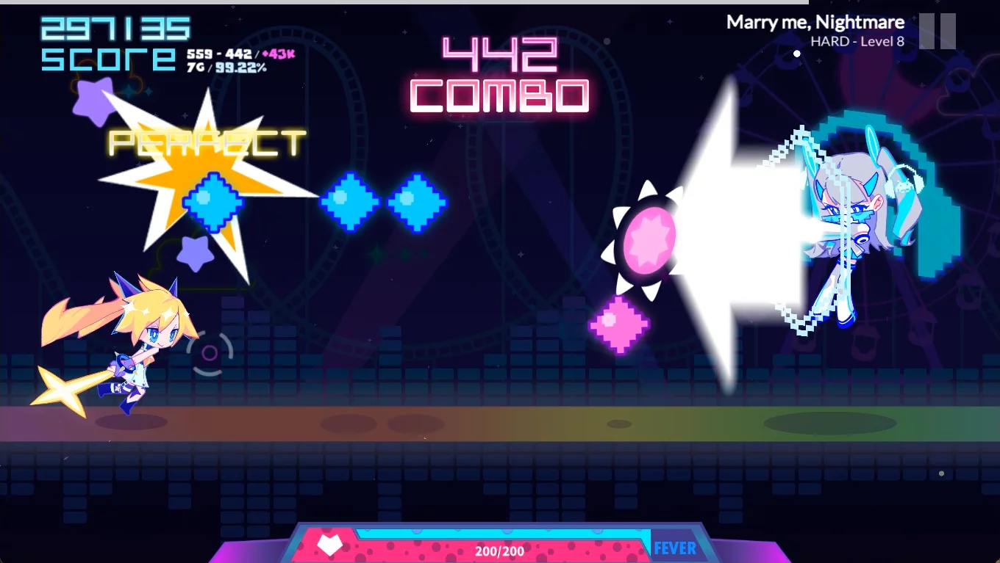
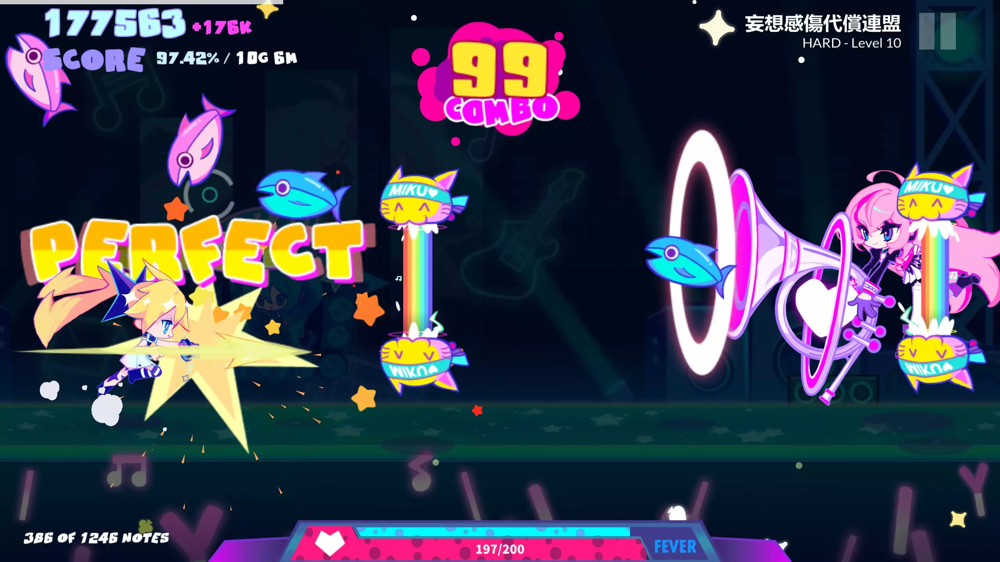

# MuseDashInfo+

[English](README.md) | [中文](README_zh.md)

### Overview

MuseDashInfo+ is a lightweight Muse Dash mod that displays additional game information.

This mod was inspired by MuseDashCustomPlay.

### Features

- **Chart Info**: Shows the current song name and chart difficulty level
- **Note Counter**: Shows total and hit note counts in real-time
- **Miss Counter**: Shows current Great/Miss counts and missed music note counts
- **Current Accuracy**: Shows real-time accuracy (may slightly deviate due to technical limitations)
- **High Score/Gap**: Shows your highest score and the current score gap from your best record
- **Replace Miss Count**: Replaces the game's original miss counter with the actual miss count, which includes ghost misses and missed during i-frame (This option also fixes a vanilla bug where hitting only the bottom note of a double note incorrectly counts as three misses)

All features can be toggled individually, and some support custom text formatting.

### Note

- If you loaded [SongDesc](https://github.com/mdmods/songdesc) mod, Chart Info will be disabled by default, use configuration to re-enable
- The Touhou Danmaku mode does not support the Note Counter/Hi-Score/Hi-Score Gap
- The Note Counter treats hold notes as two separate notes (counting both the start and end), while the Miss Counter and vanilla game count each hold note as a single note
- Hearts attached to single notes are counted by the Miss Counter, but the Note Counter and vanilla game do not count these hearts as separate notes

### Preview






### Configuration

The mod's settings can be modified in `..\MuseDash\UserData\Info+.cfg`.

This file is automatically **generated after the first launch**. Changes take effect after **restarting the game**. The following is a sample configuration file with default values:

```
[Info+]

# Show song name
DisplayChartName = true

# Show difficulty level
DisplayChartDifficulty = true

# Custom difficulty text format
# {diff} will be replaced with EASY/HARD/MASTER
# {level} will be replaced with the chart level
CustomChartDifficultyFormat = "{diff} - Level {level}"

# Show note counter
DisplayNoteCounts = true

# Custom note counter format
# {total} will be replaced with total notes
# {hit} will be replaced with current hit count
CustomNoteCountsFormat = "{hit} of {total} notes"

# Show miss counter
DisplayMissCounts = true

# Show current accuracy
DisplayAccuracy = true

# Show score difference from high score
DisplayScoreGap = true

# Show historical high score
DisplayHighestScore = false

# Show mod-calculated misses instead of game's default count on results screen
ReplaceResultsScreenMissCount = true

# Custom separator between stats
CustomSeparator = " / "
```

Note: All the custom format strings above support rich text formatting. for example: `<size=40><color=#e1bb8a>{total}</color></size>`.

### Usage

1. Install MelonLoader into Muse Dash based on the dependency listed below
2. Download the [Latest Release ](https://github.com/KARPED1EM/MuseDashInfoPlus/releases)and place `MuseDashInfo+.dll` in the `..\MuseDash\Mods\` directory
3. Launch the game and enjoy

### Dependencies

- [MelonLoader](https://github.com/LavaGang/MelonLoader/releases) v0.6.1
- [Muse Dash on Steam](https://store.steampowered.com/app/774171/Muse_Dash/)

### Developer Notes

I'm relatively new to Unity modding and have focused primarily on making the things work. The implementation might not be the most elegant. If you have any questions or would like to help improve this mod, please feel free to open an [Issue](https://github.com/KARPED1EM/MuseDashInfoPlus/issues/new) or submit a [Pull Request](https://github.com/KARPED1EM/MuseDashInfoPlus/compare). Your support is greatly appreciated!
