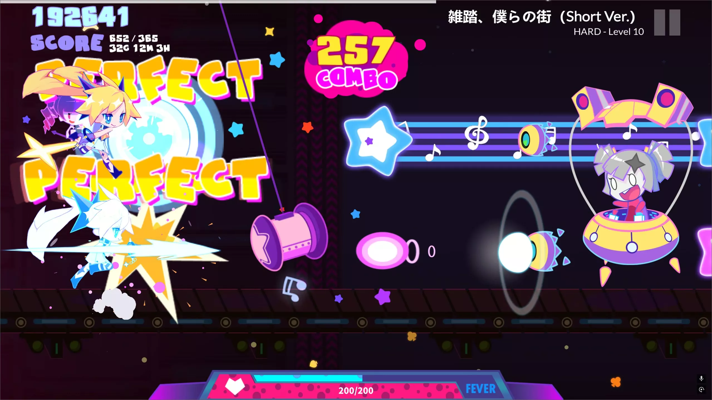
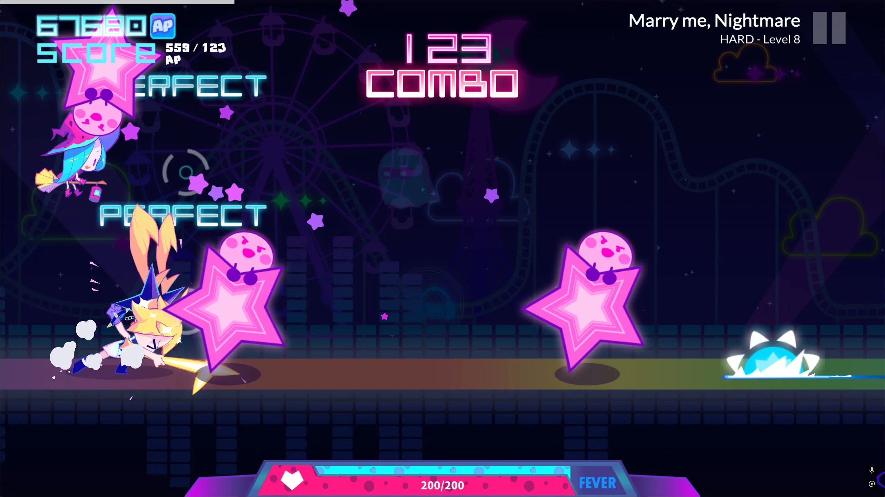

# MuseDashInfo+

[English](README.md) | [中文](README_zh.md)

### Overview
MuseDashInfo+ is a lightweight mod for MuseDash that displays additional in-game information. This mod is inspired by MuseDashCustomPlay.

### Features
- **Hit/Miss Counter**: Displays real-time hit and miss statistics in the upper-left corner during gameplay
- **Song Information**: Shows current song title and difficulty level in the upper-right corner

### Preview

### Note from Developer
I'm relatively new to Unity game modding and focused on making everything work properly. The implementation might not be the most elegant, but it gets the job done. If you have any questions or would like to help improve the mod, please feel free to open an issue - I'd really appreciate your feedback!