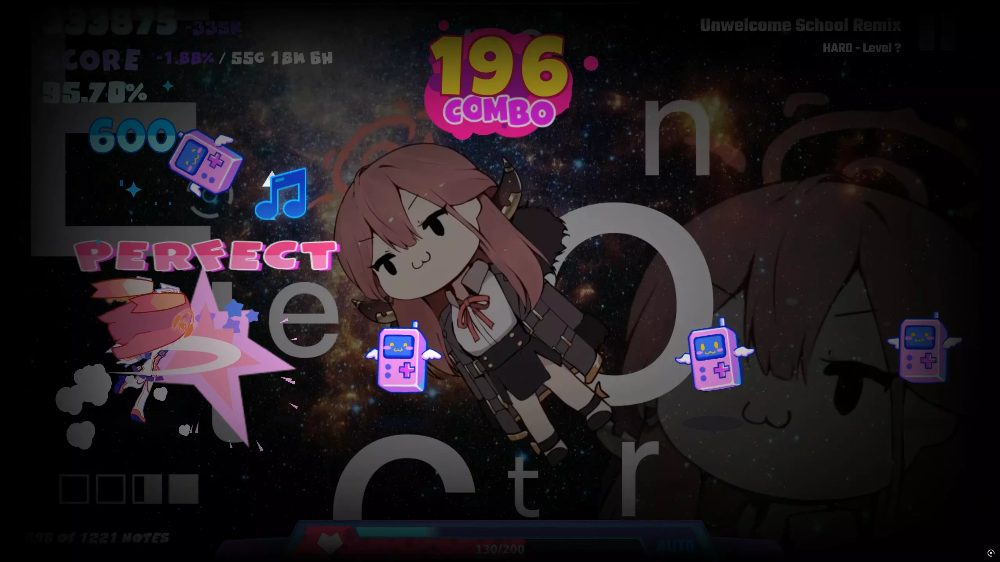

# Info+

[English](README.md) | [简体中文](README_zh-CN.md) | [繁體中文](README_zh-TW.md) | [日本語](README_ja.md) | [한국어](README_ko.md) | [Français](README_fr.md) | [Deutsch](README_de.md) | Español | [Русский](README_ru.md) | [Português](README_pt.md)

> **Atención:** Este README fue generado por IA y puede contener inexactitudes o ambigüedades. Para información precisa, consulte los README oficialmente mantenidos en [chino](README_zh-CN.md) o [inglés](README.md).

## Descripción general

Info+ es un mod de Muse Dash altamente personalizable que muestra información adicional en el juego.

Este mod está inspirado en MuseDashCustomPlay.

## Características

Muestra información variada incluyendo **Información del chart, Precisión, Contadores Miss/Great/Early/Late/Hit/Total, Diferencia de puntuación/precisión del récord personal, Velocidad cielo/suelo** y más.

Todos los elementos de datos pueden personalizarse libremente en términos de visibilidad, posición, tamaño, color, fuente, formato e incluso contorno.

## Notas importantes

- Los contadores Miss/Great/Early/Late de los récords personales no se almacenan en el juego base y solo pueden guardarse cuando Info+ está instalado. Necesita lograr al menos un récord personal con Info+ instalado para que funcione la diferencia de estadísticas del récord personal
- Si cargó el mod [SongDesc](https://github.com/mdmods/songdesc), la información del chart estará deshabilitada por defecto. Use la configuración para volver a habilitarla
- Algunos datos pueden no funcionar correctamente para charts Touhou Danmaku debido a problemas de compatibilidad
- El contador de notas trata las notas mantenidas como dos notas separadas (contando tanto el inicio como el final), mientras que el contador de Miss y el juego vanilla cuentan cada nota mantenida como una sola nota

## Vistas previas

## Configuración

Los archivos de configuración están organizados por categoría y almacenados en el directorio
`.\MuseDash\UserData\Info+\`. Todas las entradas de configuración incluyen comentarios. Por favor, comprenda el propósito de cada ajuste antes de realizar modificaciones.

Todos los archivos de configuración se **generan automáticamente en el primer inicio**. Después de modificar la configuración, **guarde el archivo y los cambios surtirán efecto inmediatamente**.

- `MainConfigs.yml`: Archivo de configuración principal
- `TextFieldLowerLeftConfigs.yml`: Configuración de texto para el área inferior izquierda de la pantalla
- `TextFieldLowerRightConfigs.yml`: Configuración de texto para el área inferior derecha de la pantalla
- `TextFieldScoreBelowConfigs.yml`: Configuración de texto para el área a la derecha de la etiqueta "SCORE" (posición permanece fija relativa a la etiqueta)
- `TextFieldScoreRightConfigs.yml`: Configuración de texto para el área a la derecha de la visualización de puntuación (posición permanece fija relativa a la puntuación)
- `TextFieldUpperLeftConfigs.yml`: Configuración de texto para el área debajo de la etiqueta "SCORE" (posición permanece fija relativa a la etiqueta)
- `TextFieldUpperRightConfigs.yml`: Configuración de texto para el área superior derecha de la pantalla
- `AdvancedConfigs.yml`: Solo para usuarios avanzados - no modifique a menos que comprenda los parámetros

### Alternar visibilidad de la interfaz

Este mod incluye una tecla de acceso rápido para alternar la visibilidad de la interfaz del juego (todas las pantallas de Info+). La tecla de acceso rápido predeterminada es **F10**.

**Opciones de configuración en MainConfigs.yml:**
- `EnableUiToggleHotkey`: Habilitar o deshabilitar la tecla de acceso rápido para alternar la interfaz (predeterminado: true)
- `UiToggleHotkey`: La tecla de acceso rápido para alternar la visibilidad de la interfaz (predeterminado: "F10")
- `UiVisibleByDefault`: Si la interfaz es visible por defecto al iniciar un nivel (predeterminado: true)

**Importante:** Si oculta accidentalmente la interfaz y no puede restaurarla, presione **F10** (o su tecla de acceso rápido configurada) para volver a activarla. Esta función puede ser útil para tomar capturas de pantalla o grabar sin elementos de interfaz.

### Marcadores de datos

En los archivos de configuración de texto, encontrará entradas como `text: '{overview} / {stats}'`. Los
marcadores `{dataName}` se reemplazarán según las siguientes reglas. Estos pueden combinarse libremente:

- `{pbScore}`: Mejor puntuación personal
- `{scoreGap}`: Diferencia entre la puntuación actual y la mejor puntuación personal
- `{pbAcc}`: Mejor precisión personal
- `{accGap}`: Diferencia entre la precisión actual y la mejor precisión personal  
- `{acc}`: Precisión actual
- `{rank}`: Rango actual
- `{total}`: Conteo total de notas
- `{hit}`: Conteo actual de golpes/recolectados/saltados
- `{song}`: Nombre del chart
- `{diff}`: Dificultad del chart (numérica)
- `{level}`: Dificultad del chart (texto)
- `{author}`: Autor del chart
- `{bpm}`: BPM del chart (datos fijos, no BPM en tiempo real)
- `{overview}`: Indicador TP/AP, muestra la precisión actual si está por debajo del 100%
- `{stats}`: Contadores Miss/Great/Early/Late
- `{pbStats}`: Contadores Miss/Great/Early/Late del récord personal
- `{pbStatsGap}`: Diferencia entre los contadores Miss/Great/Early/Late actuales y del récord personal
- `{pbGreat}`: Conteo Great del récord personal
- `{pbMissOther}`: Conteo Miss del récord personal (excluyendo misses coleccionables)
- `{pbMissCollectible}`: Conteo Miss del récord personal (solo misses coleccionables)
- `{pbEarly}`: Conteo Early del récord personal
- `{pbLate}`: Conteo Late del récord personal
- `{skySpeed}`: Velocidad cielo actual
- `{groundSpeed}`: Velocidad suelo actual
- `{time}`: Hora local del sistema

Nota: El texto enriquecido es compatible con algunas entradas de configuración. Por ejemplo:
`<size=40><color=#e1bb8a>{total}</color></size>`. Si no está familiarizado con el texto enriquecido, búsquelo. Para saltos de línea, use `\n`.

## Instalación

1. Instale MelonLoader en Muse Dash según la dependencia listada a continuación
2. Descargue la [última versión](https://github.com/KARPED1EM/MuseDashInfoPlus/releases) y coloque `Info+.dll` en el directorio `.\MuseDash\Mods\`
3. Inicie el juego y disfrute

## Dependencias

- [MelonLoader](https://github.com/LavaGang/MelonLoader/releases) v0.6.1 o v0.7.0
- [Muse Dash on Steam](https://store.steampowered.com/app/774171/Muse_Dash/)

## Notas para desarrolladores

Soy relativamente nuevo en el modding de Unity y me he centrado principalmente en hacer que las cosas funcionen. La implementación puede no ser la más elegante. Si tiene alguna pregunta o desea ayudar a mejorar este mod, no dude en abrir un [Issue](https://github.com/KARPED1EM/MuseDashInfoPlus/issues/new) o enviar una [Pull Request](https://github.com/KARPED1EM/MuseDashInfoPlus/compare). ¡Su apoyo es muy apreciado!
