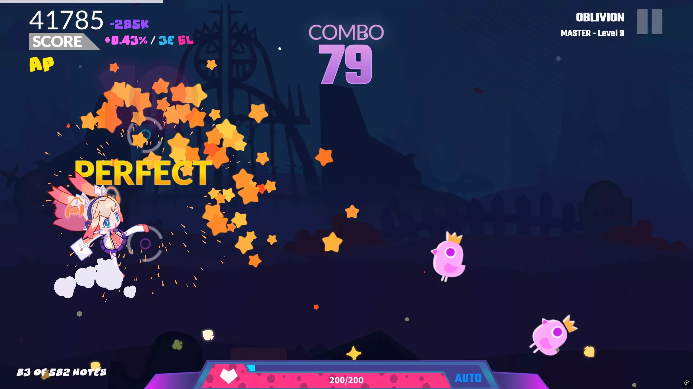
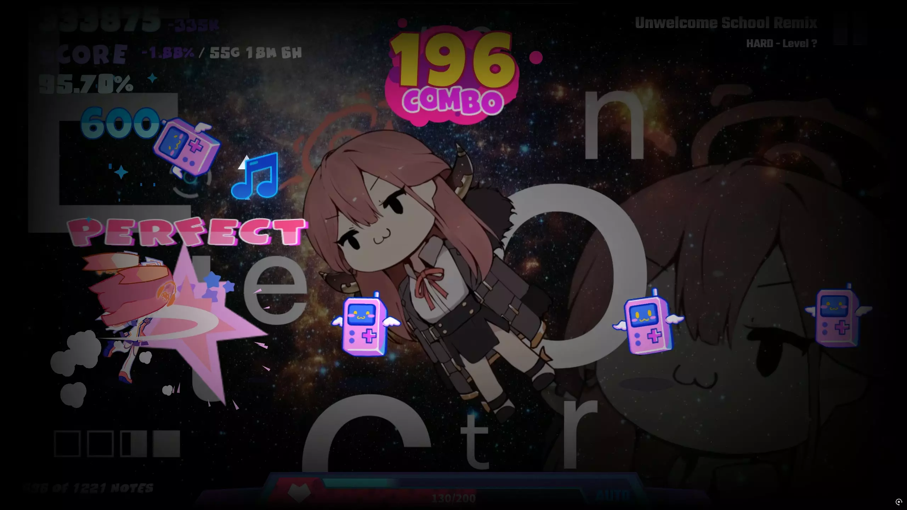

# Info+

[English](README.md) | [简体中文](README_zh-CN.md) | [繁體中文](README_zh-TW.md) | [日本語](README_ja.md) | [한국어](README_ko.md) | Français | [Deutsch](README_de.md) | [Español](README_es.md) | [Русский](README_ru.md) | [Português](README_pt.md)

> **Attention :** Ce README a été généré par IA et peut contenir des inexactitudes ou des ambiguïtés. Pour des informations précises, veuillez vous référer aux README officiellement maintenus en [chinois](README_zh-CN.md) ou en [anglais](README.md).

## Présentation

Info+ est un mod hautement personnalisable pour Muse Dash qui affiche des informations supplémentaires en jeu.

Ce mod est inspiré de MuseDashCustomPlay.

## Fonctionnalités

Affiche diverses informations, notamment **Informations sur les charts, Précision, Compteurs Miss/Great/Early/Late/Hit/Total, Écart de score/précision par rapport au record personnel, Vitesse ciel/sol** et bien plus encore.

Tous les éléments de données peuvent être librement personnalisés en termes de visibilité, position, taille, couleur, police, mise en forme et même contour.

## Notes importantes

- Les compteurs Miss/Great/Early/Late des records personnels ne sont pas stockés dans le jeu de base et ne peuvent être sauvegardés que lorsque Info+ est installé. Vous devez obtenir au moins un record personnel avec Info+ installé pour que l'écart des statistiques du record personnel fonctionne
- Si vous avez chargé le mod [SongDesc](https://github.com/mdmods/songdesc), les informations sur les charts seront désactivées par défaut. Utilisez la configuration pour les réactiver
- Certaines données peuvent ne pas fonctionner correctement pour les charts Touhou Danmaku en raison de problèmes de compatibilité
- Le compteur de notes traite les notes maintenues comme deux notes distinctes (comptant à la fois le début et la fin), tandis que le compteur de Miss et le jeu vanilla comptent chaque note maintenue comme une seule note

## Aperçus

## Configuration

Les fichiers de configuration sont organisés par catégorie et stockés dans le répertoire
`.\MuseDash\UserData\Info+\`. Toutes les entrées de configuration incluent des commentaires. Veuillez comprendre l'objectif de chaque paramètre avant d'effectuer des modifications.

Tous les fichiers de configuration sont **générés automatiquement au premier lancement**. Après avoir modifié la configuration, **enregistrez le fichier pour qu'il prenne effet** (si vous êtes dans le jeu, il prendra effet dans la prochaine partie).

- `MainConfigs.yml` : Fichier de configuration principal
- `TextFieldLowerLeftConfigs.yml` : Configuration du texte en bas à gauche de l'écran
- `TextFieldLowerRightConfigs.yml` : Configuration du texte en bas à droite de l'écran
- `TextFieldScoreBelowConfigs.yml` : Configuration du texte à droite du label "SCORE" (position fixe par rapport au label)
- `TextFieldScoreRightConfigs.yml` : Configuration du texte à droite de l'affichage du score (position fixe par rapport au score)
- `TextFieldUpperLeftConfigs.yml` : Configuration du texte sous le label "SCORE" (position fixe par rapport au label)
- `TextFieldUpperRightConfigs.yml` : Configuration du texte en haut à droite de l'écran
- `AdvancedConfigs.yml` : Pour les utilisateurs avancés uniquement - ne modifiez pas sauf si vous comprenez les paramètres

### Espaces réservés de données

Dans les fichiers de configuration de texte, vous trouverez des entrées comme `text: '{overview} / {stats}'`. Les
espaces réservés `{dataName}` seront remplacés selon les règles suivantes. Ceux-ci peuvent être combinés librement :

- `{pbScore}` : Meilleur score personnel
- `{scoreGap}` : Différence entre le score actuel et le meilleur score personnel
- `{pbAcc}` : Meilleure précision personnelle
- `{accGap}` : Différence entre la précision actuelle et la meilleure précision personnelle  
- `{acc}` : Précision actuelle
- `{rank}` : Rang actuel
- `{total}` : Nombre total de notes
- `{hit}` : Nombre de hits/collectés/sautés actuel
- `{song}` : Nom du chart
- `{diff}` : Difficulté du chart (numérique)
- `{level}` : Difficulté du chart (texte)
- `{author}` : Auteur du chart
- `{bpm}` : BPM du chart (données fixes, pas de BPM en temps réel)
- `{overview}` : Indicateur TP/AP, affiche la précision actuelle si inférieure à 100%
- `{stats}` : Compteurs Miss/Great/Early/Late
- `{pbStats}` : Compteurs Miss/Great/Early/Late du record personnel
- `{pbStatsGap}` : Différence entre les compteurs Miss/Great/Early/Late actuels et du record personnel
- `{pbGreat}` : Compteur Great du record personnel
- `{pbMissOther}` : Compteur Miss du record personnel (hors miss collectibles)
- `{pbMissCollectible}` : Compteur Miss du record personnel (miss collectibles uniquement)
- `{pbEarly}` : Compteur Early du record personnel
- `{pbLate}` : Compteur Late du record personnel
- `{skySpeed}` : Vitesse ciel actuelle
- `{groundSpeed}` : Vitesse sol actuelle
- `{time}` : Heure locale du système

Note : Le texte riche est pris en charge pour certaines entrées de configuration. Par exemple :
`<size=40><color=#e1bb8a>{total}</color></size>`. Si vous n'êtes pas familier avec le texte riche, veuillez le rechercher. Pour les sauts de ligne, utilisez `\n`.

## Installation

1. Installez MelonLoader dans Muse Dash en fonction de la dépendance listée ci-dessous
2. Téléchargez la [dernière version](https://github.com/KARPED1EM/MuseDashInfoPlus/releases) et placez `Info+.dll` dans le répertoire `.\MuseDash\Mods\`
3. Lancez le jeu et profitez-en

## Dépendances

- [MelonLoader](https://github.com/LavaGang/MelonLoader/releases) v0.6.1 ou v0.7.0
- [Muse Dash on Steam](https://store.steampowered.com/app/774171/Muse_Dash/)

## Notes pour les développeurs

Je suis relativement nouveau dans le modding Unity et me suis principalement concentré sur le fait de faire fonctionner les choses. L'implémentation n'est peut-être pas la plus élégante. Si vous avez des questions ou souhaitez aider à améliorer ce mod, n'hésitez pas à ouvrir une [Issue](https://github.com/KARPED1EM/MuseDashInfoPlus/issues/new) ou à soumettre une [Pull Request](https://github.com/KARPED1EM/MuseDashInfoPlus/compare). Votre soutien est grandement apprécié !
